# Rock, Paper, Scissors, Lizard, Spock Game
Developer : Jamie Phelps

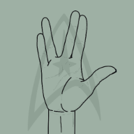

[Live Webpage](https://thephelpster.github.io/CI_PP2_RPSLS/)

# Table of Content

1. [Project Discription](#project-description)
2. [Project Goals](#project-goals)
    1. [User Goals](#user-goals)
    2. [Site Owner Goals](#site-owner-goals)
3. [User Experience](#user-experience)
    1. [Target Audience](#target-audience)
    2. [User Requrements and Expectations](#user-requrements-and-expectations)
    3. [User Stories](#user-stories)
4. [Design](#design)
    1. [Design Choices](#design-choices)
    2. [Colour](#colour)
    3. [Fonts](#fonts)
    4. [Wireframes](#wireframes)
5. [Technologies Used](#technologies-used)
    1. [Languages](#languages)
    2. [Frameworks & Tools](#frameworks-&-tools)
6. [Features](#features)
    1. [Existing Features](#existing-features)
    2. [Future Features](#future-features)
7. [Testing](#validation)
    1. [HTML Validation](#HTML-validation)
    2. [CSS Validation](#CSS-validation)
    3. [Accessibility](#accessibility)
    4. [Mock up](#mock-up)
    5. [Performance](#performance)
    6. [Device testing](#performing-tests-on-various-devices)
    7. [Browser Compatibility](#browser-compatability)
    8. [Testing User Stories](#testing-user-stories)
8. [Bugs](#Bugs)
9. [Deployment](#deployment)
10. [Credits](#credits)
11. [Acknowledgements](#acknowledgements)

# Project Description

The Rock, Paper, Scissors, Lizard, Spock or RPSLS for short website is a site where people to go to play the new version of the classic rock paper scissors game againist an ai opponant  

# Project Goals
* Enjoy a game of RPSLS against an Ai
* Track the score Against the Ai
* Learn the rules of RPSLS

## User Goals
* To play as many games of RPSLS as the I want
* To see which option the Ai has chosen to inform my next move

## Site Owner Goals
* For the players to play and enjoy a game of RPSLS
* For players to tell others about the game 

# User Experience

## Target Audience
* The Big Bang Theory watchers and fans
* Star Trek fans
* Orginial Rock Paper Scissors fans

## User Requrements and Expectations
* Easy to navigate site.
* Simple layout throughout the site to make finding information quick and easy.
* Accessiblity.

## User Stories
### First Time User
1. As a first time user, I want to be able to play a RPSLS game.
2. As a first time user, I want to be able to learn the rules of the RPSLS game.
3. As a first time user, i want to be able to see the score.

### Returning User
4. As a returning user, I want to be able to see what choices the Ai makes.
5. As a returning user, I want to be able to leave a message for what I liked and want can be improved.
6. As a returning user, i want to be to show my friends the game.

### Website Owner
7. As the website owner, I want people to enjoy the game as many times as they want.
8. as the website owner, I want people to tell their friends about the game.

# Design
## Design Choices
When choosing the design for this website i decided to go with fairly neutral greens so that the bright images of the game would stand out best.

## Colour
When picking the colours for this website I used the Colorspace colour generator to help find ones that would complement each other on the screen. 

## Fonts
To  find the fonts I  wanted to use, I  searched through the google fonts webpage to find two different but complementary fonts. 

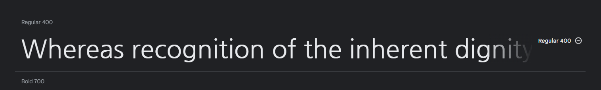

## Wireframes

Home

 
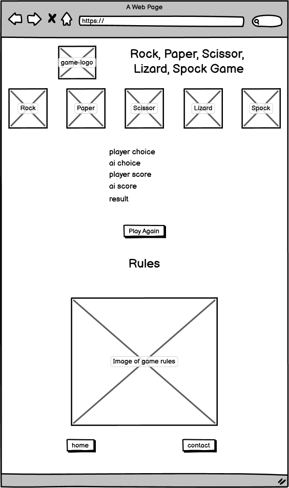 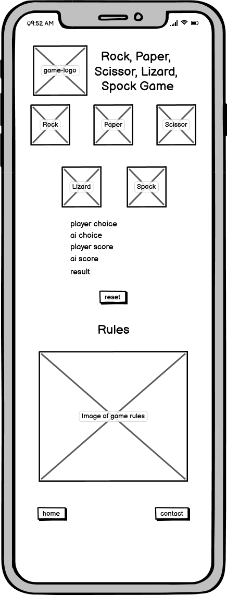

Contact

 
 

# Technologies Used
## Languages
* HTML
* CSS
* JS

## Frameworks & Tools
* Git
* GitHub
* GitPod
* Balsamiq
* Google Fonts
* Font Awesome
* Favicon.io
* W3S Tutourials

# Features
## Existing Features
Favicon
The first feature on the website is the use of a favicon on every page’s tab. The favicon is a much smaller version of the website logo that changes depending on what device it’s being shown on.

 

Game Buttons
The game buttons are the most important element that you can see on the page. They are the elements that allow the user to be able to play the game, thats also why they are the most colourful and eye catching of the whole page. They also change colour depending on if you've selected them as part of the game.

User stories covered: 1, 7

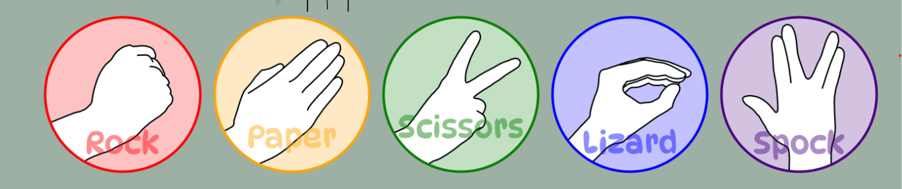

Score Area
The Score area is an important part of the game as it shows the user thier score compared to the Ais and let the user know if they won or lost the round.

User stories covered: 3, 4

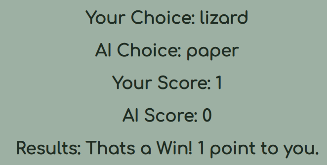

Reset Button
The reset button is located just below the score area so if the user wants to reset the game without reloading the page they can.

User stories covered: 7

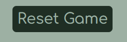

Game Rules
The rules of the game are towards the bottom of the page and there for a reminder to players that already know them or to inform the players who havent learnt them.

User stories covered: 2

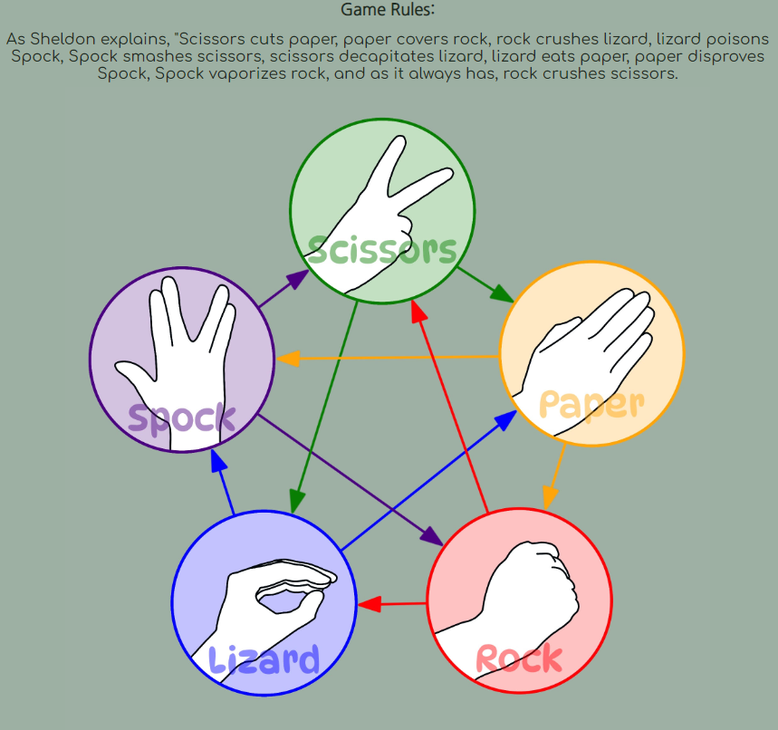

Footer Links
The footer is built up of 3 link buttons. 2 of which link to the pages on the site and one is a link to facebook.

User stories covered: 5, 6, 8

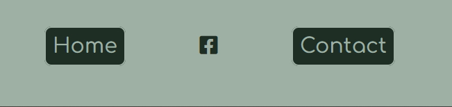

Contact Form
On the contact page there is the contact form where users of the page can contact the site owner to leave messages either to say how much they like the game or to state ways that the owner can improve the game.

User stories covered: 5

404 Page
the last page is the custom 404 error page that will display if the user imputs the wrong address into the browser window.

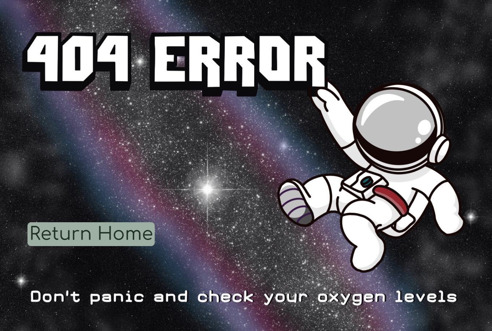

## Future Features
* A score limit and leaderboard
* A time delay for the Ai choice to make it feel more like your playing against a real person

# Validation
I put my website through the following validation tools:

## HTML Validation

Home

 
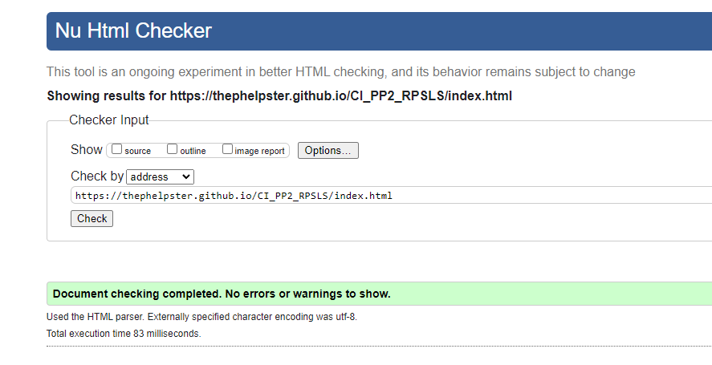

Contact

 
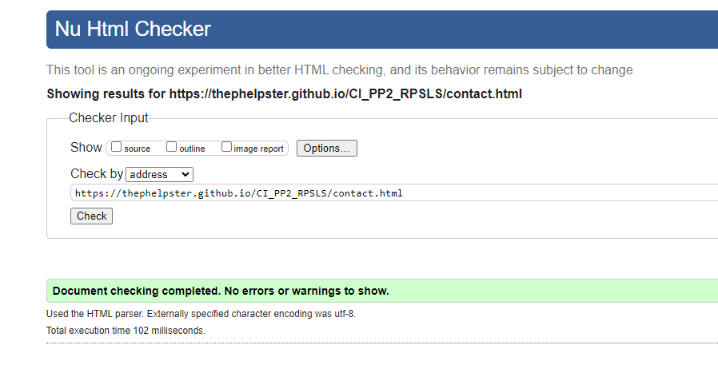

404

 
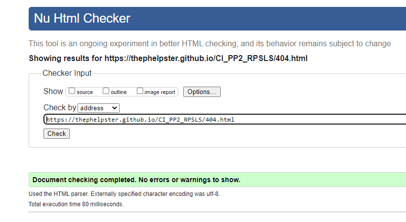

### CSS Validation: 

Home

 
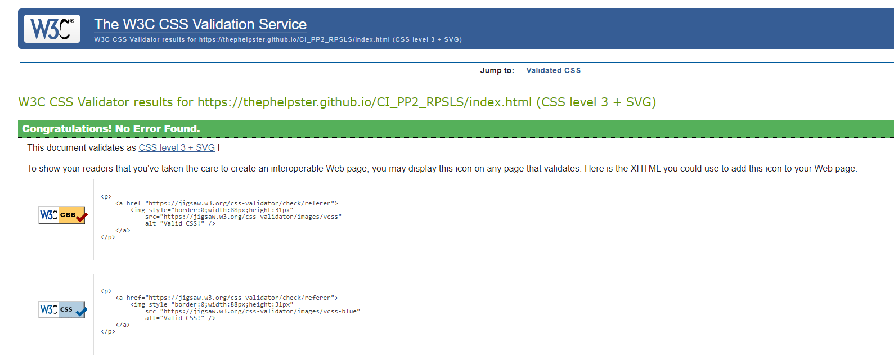

Contact

 
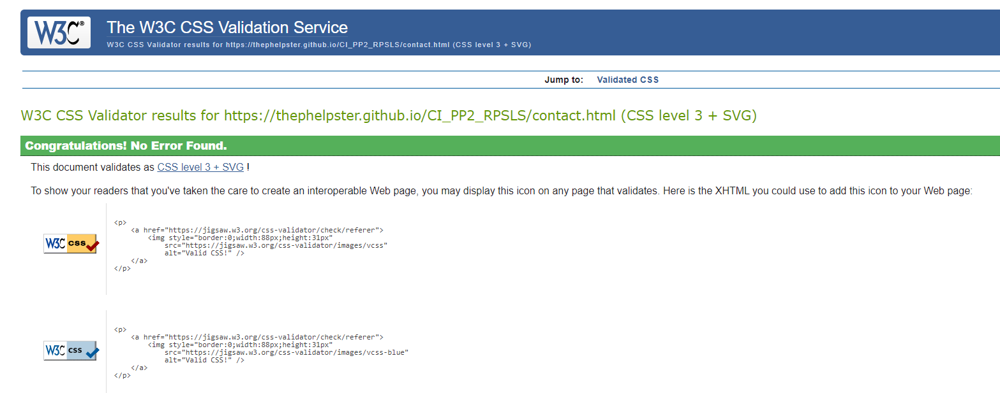

404

 
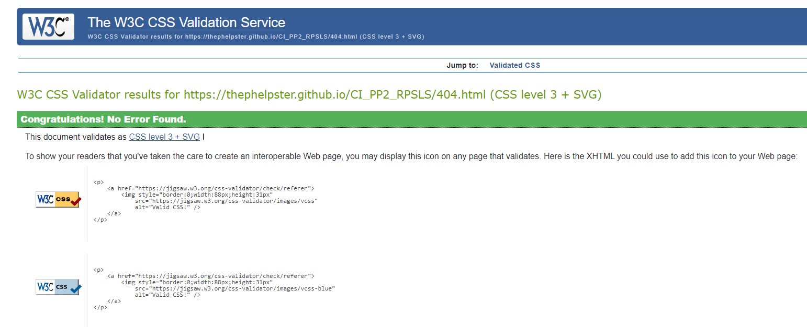

### Accessibility: 

Home

 
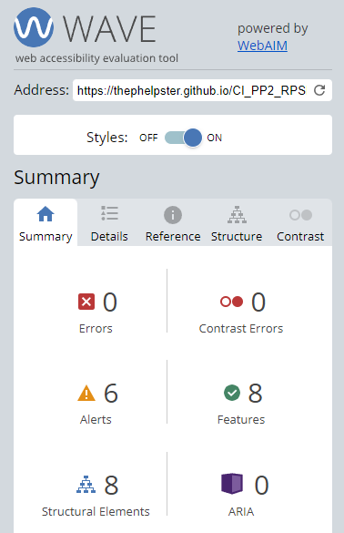

Contact

 

404

 
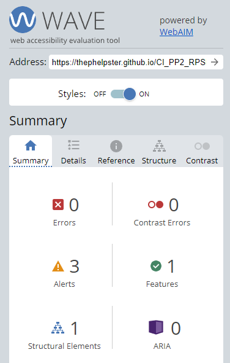

### Mock up

Am I Responsive

 
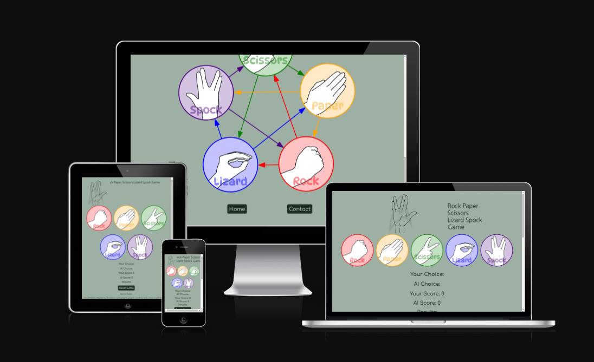

### Performance

Home

 

Home

 

Contact

 

Contact

 

404

 
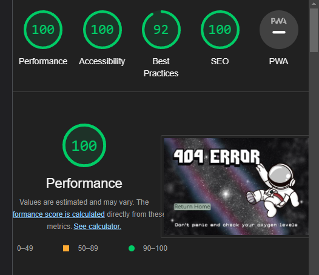

404

 
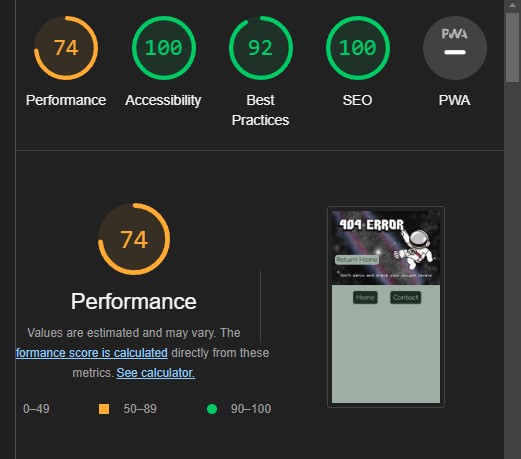

### Device testing
* iPhone XS Max
* iPad Pro
* Hp Laptop 
* Hp Desktop

All pages have also been tested on all available screen sizes on google chrome dev tools 

### Browser Compatibility
Google Chrome
Microsoft Edge

### Testing user stories

1. As a first time user, I want to be able to play a RPSLS game.

| **Feature** | **Action** | **Expected Result** | **Actual Result** |
|-------------|------------|---------------------|-------------------|
| Game buttons | click on RPSLS choice | adds choice to score area | highlights and logs on score area |

2. As a first time user, I want to be able to learn the rules of the RPSLS game.

| **Feature** | **Action** | **Expected Result** | **Actual Result** |
|-------------|------------|---------------------|-------------------|
| Game rules | scroll down to rules | look for the rules | see rules |

3. As a first time user, i want to be able to see the score.

| **Feature** | **Action** | **Expected Result** | **Actual Result** |
|-------------|------------|---------------------|-------------------|
| Score area | scroll down to score area | see score area | see the current score |

4. As a returning user, I want to be able to see what choices the Ai makes.

| **Feature** | **Action** | **Expected Result** | **Actual Result** |
|-------------|------------|---------------------|-------------------|
| Score area | scroll down to score area | look for the ai score | see the ai score |

5. As a returning user, I want to be able to leave a message for what I liked and want can be improved.

| **Feature** | **Action** | **Expected Result** | **Actual Result** |
|-------------|------------|---------------------|-------------------|
| Contact form | scroll to footer and click on contact page link | load contact page and fill out form | fill out form |

6. As a returning user, i want to be to show my friends the game.

| **Feature** | **Action** | **Expected Result** | **Actual Result** |
|-------------|------------|---------------------|-------------------|
| Footer links | scroll down to footer and click on facebook | link to facebook to share the page | link to facebook to share on users page |

7. As the website owner, I want people to enjoy the game as many times as they want.

| **Feature** | **Action** | **Expected Result** | **Actual Result** |
|-------------|------------|---------------------|-------------------|
| reset button | click the reset button | reset the game without reseting the page | reset the game without reseting the page |

8. As the website owner, I want people to tell their friends about the game.

| **Feature** | **Action** | **Expected Result** | **Actual Result** |
|-------------|------------|---------------------|-------------------|
| footer links | scroll down to footer and click on facebook | link to facebook to share the page | link to facebook to share on users page |

## Bugs
| **Bug** | **Fix** |
| ----------- | ----------- |
| position of elements on iphone5 screen size | add media queries to change how elements look on different sized screens |
| linking js script pages to game page | double check root and spelling to make sure everything is correct |
| reset form button sending emails | change the js to a more simple function |
| email address would come up as suggestion on name input on form | change the name element to email in the email input of the form  |
| wrong messages win messages coming up when playing the game | check the game rules to make sure the matched the js win conditions |

# Deployment
The website was deployed using GitHub Pages by following these steps:
1. In the GitHub repository navigate to the Settings tab
2. On the left hand menu select Pages
3. For the source select Branch: main
4. Once saved, GitHub will refresh and your website will be publishd from GitHub repository
5. The link to your published website will appear: "Your site is published at https://thephelpster.github.io/CI_PP2_RPSLS/"

### Forking the GitHub Repository
1. Go to the GitHub repository
2. Click on Fork button in top right corner

### Making a Local Clone
1. Go to the GitHub repository 
2. Locate the Code button above the list of files and click it
3. Highlight the "HTTPS" button to clone with HTTPS and copy the link
4. Open Git Bash
5. Change the current working directory to the one where you want the cloned directory
6. Type git clone and paste the URL from the clipboard ($ git clone https://github.com/YOUR-USERNAME/YOUR-REPOSITORY)
7. Press Enter to create your local clone
# Credits
Images and text not referenced below is owned and created by the developer.

## Content
Intructions on how to play the RPSLS game came from The Big Bang tv show.

## Code and Design
* Colorspace - for the colour pallet
https://mycolor.space/?hex=%239DB0A3&sub=1

* Googlefonts - for the font styles
https://fonts.google.com/specimen/Comfortaa
https://fonts.google.com/specimen/Nanum+Gothic

* W3schools - for js script ideas and help
https://www.w3schools.com/jsref/met_document_queryselector.asp

* Favicon.io - for converting the logo into a favicon
https://favicon.io/

* EmailJS - for the js and tutorial for linking a contact form with js
https://www.emailjs.com/docs/tutorial/overview/

# Acknowledgements
This has been a far more challenging build as it took me a lot long to get to grips with JS and testing the elements to amke sure they all worked as I wanted them to. I restarted this project twice before finally getting to this version but in the end it has helped me understand JS a lot better than before starting this project.

I'd like to thank these people who gave me all the help and support i needed to finish and make this project look as good as it does.

* Mo Shami, my mentor, for all the guidance, help and advice.
* Kate Cleal, my partner, for designing the 404 page image, the logo image, the game buttons and being my spell checker for all the text and giving me the time to be able to complete this project.