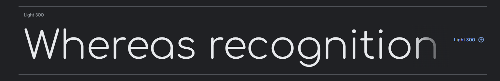
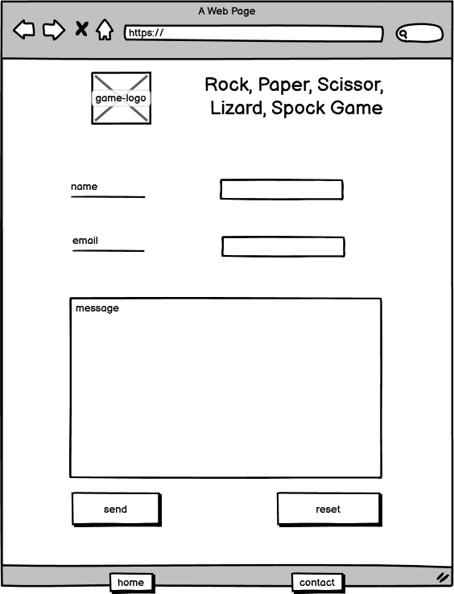
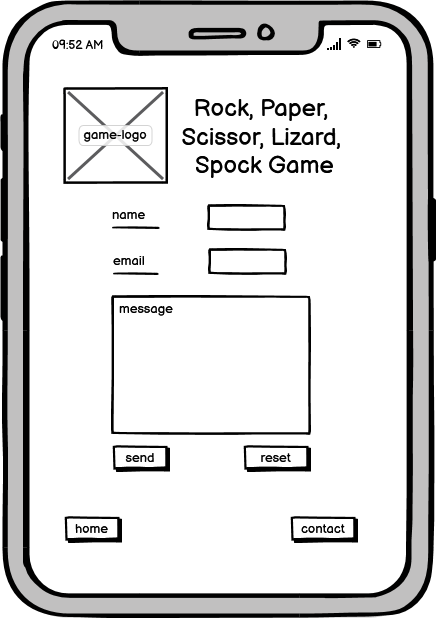
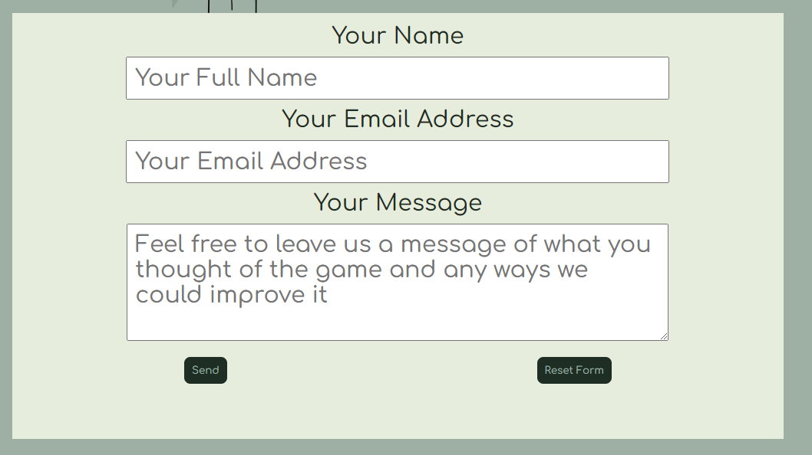
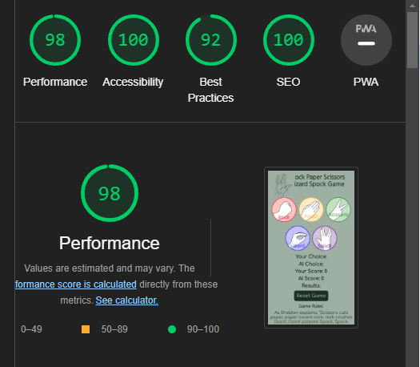
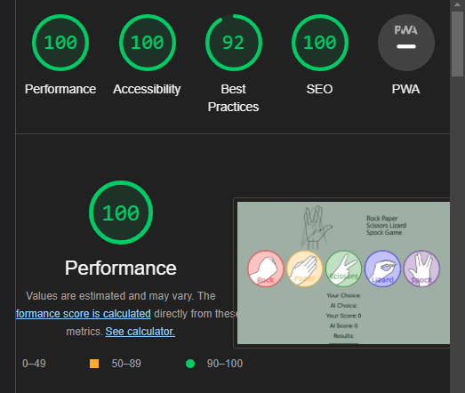
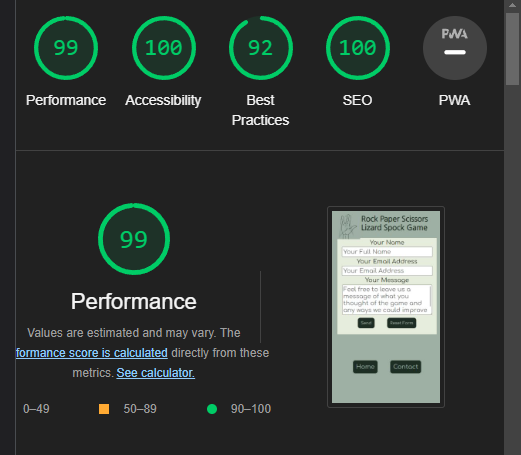
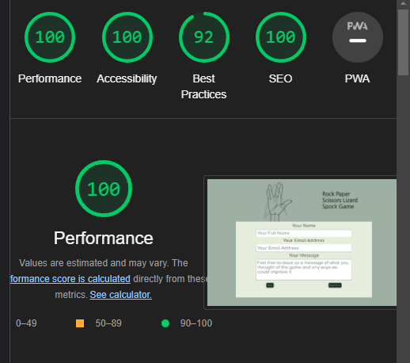

# The Campervan Factory
Developer : Jamie Phelps

[Live Webpage](https://thephelpster.github.io/CI_PP1_CF/)

# Table of Content

1. [Project Discription](#project-description)
2. [Project Goals](#project-goals)
    1. [User Goals](#user-goals)
    2. [Site Owner Goals](#site-owner-goals)
3. [User Experience](#user-experience)
    1. [Target Audience](#target-audience)
    2. [User Requrements and Expectations](#user-requrements-and-expectations)
    3. [User Stories](#user-stories)
4. [Design](#design)
    1. [Design Choices](#design-choices)
    2. [Colour](#colour)
    3. [Fonts](#fonts)
    4. [Wireframes](#wireframes)
5. [Technologies Used](#technologies-used)
    1. [Languages](#languages)
    2. [Frameworks & Tools](#frameworks-&-tools)
6. [Features](#features)
    1. [Existing Features](#existing-features)
    2. [Future Features](#future-features)
7. [Testing](#validation)
    1. [HTML Validation](#HTML-validation)
    2. [CSS Validation](#CSS-validation)
    3. [Accessibility](#accessibility)
    4. [Mock up](#mock-up)
    5. [Performance](#performance)
    6. [Device testing](#performing-tests-on-various-devices)
    7. [Browser Compatibility](#browser-compatability)
    8. [Testing User Stories](#testing-user-stories)
8. [Bugs](#Bugs)
9. [Deployment](#deployment)
10. [Credits](#credits)
11. [Acknowledgements](#acknowledgements)

# Project Description

The Campervan Factory website is where you can go to find information about what products the company offers. The site shows examples of the conversions that are produced, history of the company and the means to be able to get in contact to start the process of buying a campervan.

# Project Goals

## User Goals
* Finding a Campervan conversion they're confident  in.
* Finding a breakdown of the conversion specifications.
* Finding the company’s  history and background.
* Finding the location of The Campervan Factory.

## Site Owner Goals
* Improve sales through a  clear and accessible  site.
* Improve  communication  through an  easy-to-use  contact page.
* Improve ease of locating the workshop
* Layout  information in a clear and easy to read manner.

# User Experience

## Target Audience
* People looking to buy a VW Campervan
* People looking for previous customer experiences
* People wanting to visit the workshop location
* People wanting to sign up for the weekly newsletter

## User Requrements and Expectations
* Easy to navigate site.
* Simple layout throughout the site to make finding information quick and easy.
* Accessiblity.
* Plently of pictures detailing the conversions
* Easy to use contact page with a variety of options for contacting  the company.

## User Stories
### First Time User
1. As a first time user, I want to find images of the campervans.
2. As a first time user, I want to find information about the company.
3. As a first time user, I want to find reviews from pervious customers.
4. As a first time user, I want to find links to social media sites.

### Returning User
5. As a returning user, I want to see the build process of the campervans.
6. As a returning user, I want to see the opening times.
7. As a returning user, I want to see more details about the conversions.
8. As a returning user, I want to see more information about the staff.
9. As a returning user, I want to be able to contact the campervan factory to ask questions.
10. As a returning user, I want to see all contact information eg. phone numbers and email address.
11. As a returning user I want to see a map showing the location of the campervan factory.
12. As a returning user I want to see a video explaining how the conversion works.
13. As a returning user I want to sign up to a mailing list to recieve the latest information and offers.

### Website Owner
14. As the website owner, I want users to find information about the company.
15. As the website owner, I want users to see reviews from pervious customers.
16. As the website owner, I want users to see what conversions are on offer.

# Design
## Design Choices
I've chosen the design style based on using a colourful background, text and logo to give a friendly feel to the website and by extension, the company. The colours also tie in with the colours chosen for the uniforms and signage at the factory.

## Colour
When  picking the colours for this  website I  used the Colorspace  colour generator to help find ones  that would complement each other on the screen. The  base colours also had to be in keeping with the colours of The  Campervan Factory’s  sign that is visible in some of the images.
After  I  picked my base colours,  I  then edited them slightly when called for. For example,  softening  the colours and making the text box backgrounds slightly transparent.

## Fonts
To  find the fonts I  wanted to use, I  searched through the google fonts webpage to find two different but complementary fonts. 

## Wireframes

Home

 
 

About

 
 

Conversions

 
 

Contact

 
 

Gallery

 
 

404 Error

 
 

# Technologies Used
## Languages
* HTML
* CSS

## Frameworks & Tools
* Git
* GitHub
* GitPod
* Bootstrap
* Balsamiq
* Google Fonts
* Font Awesome
* Favicon.io
* W3S Tutourials

# Features
## Existing Features
### Favicon
The first feature on the website is the use of a favicon on every page’s  tab. The  favicon is a much smaller version of the main company logo that changes depending on what device  it’s  being shown on.

 

### Navbar
The navbar has links to all pages and all links work when selected. I used the same design and sizing across the website to keep a consistent and professional structure.  The navbar also collapses  when appearing  on a different sized screen, for example, a  mobile device.

### First Page Carousel
The carousel on the home page is the first feature you see alongside  the navbar. It cycles through three images of campervans  giving the user  an idea of what the campervans look like straight  away.

### Company Background Information and Background Image
This is the first paragraph of information explaining about the company and giving the user  a feel for what they are buying into.

The paragraph is also accompanied  by a background image that shows the workshop. The text is framed in a slightly transparent  box so the image behind is still visible but doesn’t  make the text hard to read.

User stories covered: 1, 2 and 14

### Newsletter Signup
This section of page allows the user   to  keep up to date with the latest information coming from The Campervan Factory . It’s  a good way for potential customers to find out more information. 

The newsletter form includes placeholder text, fields that must be completed and clearly marked labels for each field.

User stories covered: 13

### Footer
The footer is made up of links to the company’s social media pages to keep potential and existing customer up to date with any new information. The use of multiple social media platforms allows the company to reach a much wider audience.

The footer is consistently in the same position and has the same layout making it easy to find and navigate to the links regardless of which part of the site the user is on. 

User stories covered: 4

### About Page Information
Most of this page is information based,  giving the viewer a better understanding of the company and the  reassurance  that the conversions are built professionally . I used background images to break up  the text to make the page more enjoyable to read through.

The design has been mirrored from the previous  pages to  add consistency and harmonisation throughout the website. 

User stories covered: 1, 2, 8 and 14

### BBC Points West Interview Video
This video gives the user  an  idea of the day-to-day  workings within The Campervan Factory.  Having been filmed during the Covid-19 pandemic, it shows the company’s growing popularity in a time when people were not able to immediately use the campervans they were purchasing. 

I left out auto play  on this video and  included video controls so that the user  can  decide if/when  they want  to watch the video. 

User stories covered: 1, 2, 5, 8 and 14

### The Conversion Page
The  conversion page uses many of the existing  features but in a different layout. This  continues to keep the website consistent and uniform. It also sets out the information so that it’s not overwhelming for the user.  Elements that have been used again are, text in coloured boxes, a video  and a carousel.

Similar to the video on the about page, I left out auto play on this one with video controls included.  

User stories covered: 1, 2, 7, 8, 12, 14 and 16

### Contact Table
On the contact page I  used a table to layout the contact  information, making it easy and clear for the user   to  find the information and get in contact with the company. Using  a table to compile this  information will also make it easy for any future changes to be made, for example, if the telephone number or email address changes.  

User stories covered: 10 and 6

### Contact Form
Another  way to contact the company is through the contact form I  added to the page. This  gives the user  a quick and easy way to contact the company.  

Unlike  the form on the first page,  this one includes a text box that the user  can input any question, concern or comment they may have. 

User stories covered: 9

### Google Map iframe
A google map iframe has been added to the bottom of the contact page giving the user  the ability to find where the workshop is with ease. This  allows the user  to be able to visit  the workshop and get a first-hand  view of how campervans are built and view any finished vans.

User stories covered: 11

### Gallery Page
The gallery page also doubles as a review page so users  can read what existing customers have to say about the campervan they purchased and the company.  Each  review has corresponding  images that were taken by  the customers showing off their  campervans on different adventures all over the world. 

User stories covered: 3, 15

## Future Features
To  include a way of posting reviews on the page directly instead of the site owner posting these manually. There are a couple of reasons for this, firstly, manually posting them gives the impression that the company are cherry-picking the good reviews. Secondly, it will take less time for the reviews to be added to the site as they will be added immediately rather than waiting for the site owner to manually add them. 

# Validation
I put my website through the following validation tools:

## HTML Validation

Home

 

About

 

Conversion

 

Contact

 

Gallery

 

404 Error

 

### CSS Validation: 

Whole Page

 

style.css

 

### Accessibility: 

Home

 

About

 

Conversion

 

Contact

 

Gallery

 

404 Error

 

### Mock up

Am I Responsive

 

### Performance

Home Mobile

 

Home Desktop

 

About Mobile

 

About Desktop

 

Conversion Mobile

 

Conversion Desktop

 

Contact Mobile

 

Contact Desktop

 

Gallery Mobile

 

Gallery Desktop

 

### Device testing
* iPhone XS Max
* iPad Pro
* Hp Laptop 
* Hp Desktop

All pages have also been tested on all available screen sizes on google chrome dev tools 

### Browser Compatibility
Google Chrome
Microsoft Edge

### Testing user stories
1. As a first time user, I want to find images of the campervans

| **Feature** | **Action** | **Expected Result** | **Actual Result** |
|-------------|------------|---------------------|-------------------|
| Carousel images | Scroll down to carousel | See the pictures campervans | Works as expected |
| About page | Go to navbar, select About page and scroll down to Background information | read the information | Works as expected |
| BBC Interview | Go to navbar, select About and scroll down to the video | Press play on the video | Works as expected |
| Conversion page | Go to navbar, select Conversion and scroll down to the pictures | See the pictures | Works as expected |

2. As a first time user, I want to find information about the company

| **Feature** | **Action** | **Expected Result** | **Actual Result** |
|-------------|------------|---------------------|-------------------|
| Background Info | Scroll down to see the background information | read about the company | Works as expected |
| About page | Go to navbar, select About page and scroll down to Background information | read the information | Works as expected |
| BBC Interview | Go to navbar, select About and scroll down to the video | Press play on the video | Works as expected |
| Conversion page | Go to navbar, select Conversion and scroll down to the pictures | See the pictures | Works as expected |

3. As a first time user, I want to find reviews from pervious customers

| **Feature** | **Action** | **Expected Result** | **Actual Result** |
|-------------|------------|---------------------|-------------------|
| Gallery page | Go to navbar, select Gallery and scroll down to reviews | Read reviews | Works as expected |

4. As a first time user, I want to find links to social media sites

| **Feature** | **Action** | **Expected Result** | **Actual Result** |
|-------------|------------|---------------------|-------------------|
| Footer | Scroll down to the bottom of the page | Click on the social media link you want | Works as Expected |

5. As a returning user, I want to see the build process of the campervans

| **Feature** | **Action** | **Expected Result** | **Actual Result** |
|-------------|------------|---------------------|-------------------|
| BBC Interview | Go to navbar, select About and scroll down to the video | Press play on the video | Works as expected |

6. As a returning user, I want to see the opening times

| **Feature** | **Action** | **Expected Result** | **Actual Result** |
|-------------|------------|---------------------|-------------------|
| Contact table | Go to navbar, select contact us and scroll down to contact table | See opening times | Works as expected |

7. As a returning user, I want to see more details about the conversions

| **Feature** | **Action** | **Expected Result** | **Actual Result** |
|-------------|------------|---------------------|-------------------|
| Conversion page | Go to navbar, select Conversion and scroll down to the pictures | See the pictures | Works as expected |

8. As a returning user, I want to see more information about the staff

| **Feature** | **Action** | **Expected Result** | **Actual Result** |
|-------------|------------|---------------------|-------------------|
| About page | Go to navbar, select About page and scroll down to Background information | read the information | Works as expected |
| BBC Interview | Go to navbar, select About and scroll down to the video | Press play on the video | Works as expected |
| Conversion page | Go to navbar, select Conversion and scroll down to the pictures | See the pictures | Works as expected |

9. As a returning user, I want to be able to contact the campervan factory to ask questions

| **Feature** | **Action** | **Expected Result** | **Actual Result** |
|-------------|------------|---------------------|-------------------|
| Contact Form | Go to navbar, select Contact and scroll down to the contact form | Find Contact form | Works as expected |

10. As a returning user, I want to see all contact information eg. phone numbers and email address

| **Feature** | **Action** | **Expected Result** | **Actual Result** |
|-------------|------------|---------------------|-------------------|
| Contact table | Go to navbar, select contact us and scroll down to contact table | See opening times | Works as expected |

11. As a returning user I want to see a map showing the location of the campervan factory

| **Feature** | **Action** | **Expected Result** | **Actual Result** |
|-------------|------------|---------------------|-------------------|
| Google map iFrame | Go to navbar, select Contact and scroll down to the google maps iframe | see the location of the campervan factory | Works as expected |

12. As a returning user I want to see a video explaining how the conversion works

| **Feature** | **Action** | **Expected Result** | **Actual Result** |
|-------------|------------|---------------------|-------------------|
| Conversion page | Go to navbar, select Conversion and scroll down to the pictures | See the pictures | Works as expected |

13. As a returning user I want to sign up to a mailing list to recieve the latest information and offers

| **Feature** | **Action** | **Expected Result** | **Actual Result** |
|-------------|------------|---------------------|-------------------|
| Newsletter form | Scroll down to the newsletter form | Find the newsletter form | Works as expected |

14. As the website owner, I want users to find information about the company

| **Feature** | **Action** | **Expected Result** | **Actual Result** |
|-------------|------------|---------------------|-------------------|
| Background Info | Scroll down to see the background information | read about the company | Works as expected |
| About page | Go to navbar, select About page and scroll down to Background information | read the information | Works as expected |
| BBC Interview | Go to navbar, select About and scroll down to the video | Press play on the video | Works as expected |
| Conversion page | Go to navbar, select Conversion and scroll down to the pictures | See the pictures | Works as expected |

15. As the website owner, I want users to see reviews from pervious customers

| **Feature** | **Action** | **Expected Result** | **Actual Result** |
|-------------|------------|---------------------|-------------------|
| Gallery page | Go to navbar, select Gallery and scroll down to reviews | Read reviews | Works as expected |

16. As the website owner, I want users to see what conversions are on offer

| **Feature** | **Action** | **Expected Result** | **Actual Result** |
|-------------|------------|---------------------|-------------------|
| Conversion page | Go to navbar, select Conversion and scroll down to the pictures | See the pictures | Works as expected |

## Bugs
| **Bug** | **Fix** |
| ----------- | ----------- |
| Position of image error when viewed on iphone5 screen | Change width value to use 'vw' instead of 'px |
| Contrast colour error on submit button | Change to colours that are easier to view on background colour|
| lack of aria label on home button on 404.html page | add aria label to button | 
| Font too small to be easy to read on small screens | Increase font size using 'vw' sizes |
| performance of pages slow to load | resize images down to better size and convert to webp |

# Deployment
The website was deployed using GitHub Pages by following these steps:

1. In the GitHub repository navigate to the Settings tab
2. On the left hand menu select Pages
3. For the source select Branch: main
4. After the webpage refreshes automaticaly you will se a ribbon on the top saying: "Your site is published at
https://thephelpster.github.io/CI_PP1_CF/

A Link to the live site: [The Campervan Factory](https://thephelpster.github.io/CI_PP1_CF/)

# Credits
Images, videos and text not referenced below is owned and created by the developer.

## Content
* The Cover text, background information and reviews were taken from The Campervan Factory website

## Media
* Images of the campervans are taken from The Campervan Factory website.
* Video of the BBC Interview is owned by the BBC.

## Code and Design
* Colorspace - for the colour pallet
https://mycolor.space/?hex=%23845EC2&sub=1

* Googlefonts - for the font styles
https://fonts.google.com/specimen/Comfortaa

* Googlemaps - for the google map element added to the iframe
https://www.google.com/maps/@51.9959798,-2.1395935,17z

* W3schools - for the navbar and carousel bootstrap
1. https://www.w3schools.com/bootstrap/bootstrap_navbar.asp
2. https://www.w3schools.com/bootstrap/bootstrap_carousel.asp

* Favicon.io - for converting the logo into a favicon
https://favicon.io/

* Font Awesome - for the social media fonts used in the footer
https://fontawesome.com/

# Acknowledgements
I'd like to thank these people who gave me all the help and support i needed to finish and make this project look as good as it does.

* Mo Shami, my mentor, for all the guidance, help and advice.
* Kate Cleal, my partner, for designing the 404 page image, the logo image, being my spell checker for all the text and giving me the time to be able to complete this project.
* The Campervan Factory, my old workplace, for giving me the inspiration for this website and the images used.